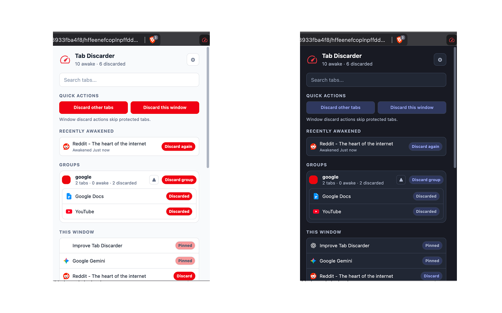
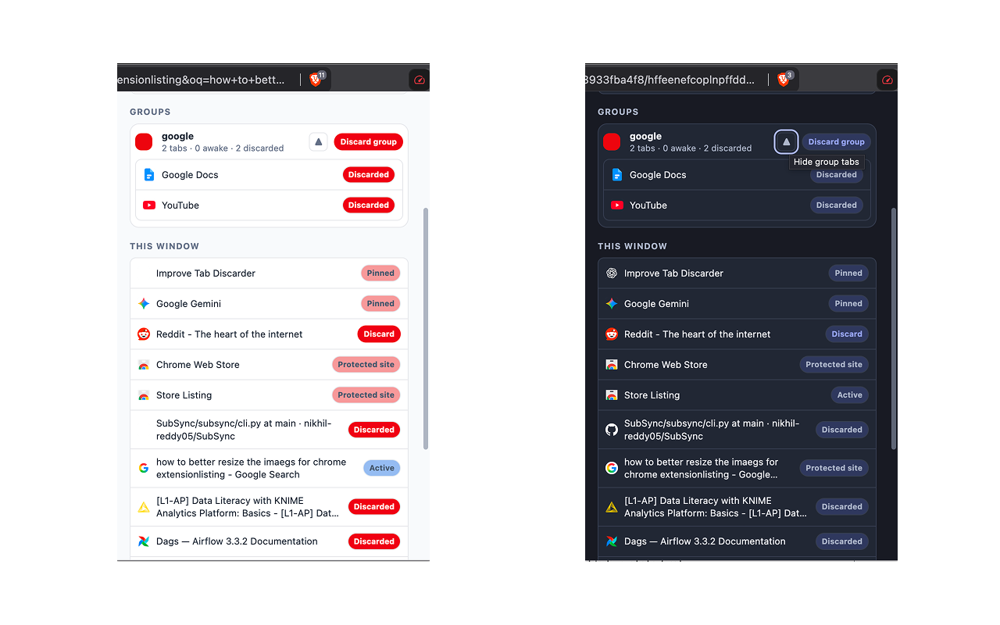
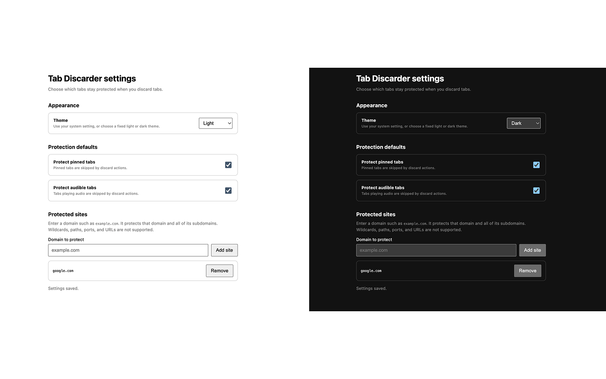

# Tab Discarder

**Tab Discarder** is a lightweight Chrome extension for manually discarding inactive or background tabs to reduce Chrome memory usage without closing them. Discard individual tabs, eligible tabs in the current window, or entire Chrome tab groups while protecting active, pinned, audible, and selected sites. Discarded tabs remain in the tab strip and reload when you return to them.

## What is Tab Discarder?

Tab Discarder is a manual Chrome tab memory manager. It gives you direct control over when Chrome releases resources used by background tabs instead of deciding that a tab should be discarded merely because you switched away.

Chrome keeps a discarded tab open, preserving its title and position. Activating that tab asks Chrome to reload its page. The extension never describes discarding as closing a tab and does not automatically re-discard tabs.

## Features

- View the current window with live **Active**, **Awake**, **Discarded**, **Pinned**, **Playing audio**, and **Protected site** states.
- Use **Discard** on an eligible individual tab.
- Use **Discard other tabs** or **Discard this window** to process eligible background tabs in the current window. In V3, both actions use the same safety-checked current-window operation.
- Search current-window tabs by title or address.
- View Chrome tab groups, expand their members, and use **Discard group**.
- Use **Discard this group** when the active tab belongs to a group.
- Review **Recently awakened** tabs and choose **Discard again**.
- Configure pinned-tab, audible-tab, and domain protection.
- Follow the system color scheme or select a fixed light or dark theme.
- Use a keyboard shortcut to discard the most recent eligible Recently awakened tab.

All discard actions are manual. Switching tabs alone never triggers a discard.

## How manual tab discarding works

1. Open the Tab Discarder popup.
2. Choose an eligible tab, group, or current-window action.
3. The extension reads that tab's live state immediately before asking Chrome to discard it.
4. Chrome releases resources when it can and leaves the discarded tab visible in the tab strip.
5. The page reloads when you activate the tab again.

A tab that becomes active, protected, already discarded, no longer in the selected group, or stale before the operation is skipped. If Chrome replaces a tab while an individual action is in progress, Tab Discarder follows a verified replacement event or safely stops instead of acting on an unrelated tab ID.

## Tab states and protection rules

The active tab and already-discarded tabs are always skipped. By default, Tab Discarder also protects:

- pinned tabs;
- tabs playing audio; and
- every hostname added under **Protected sites**, including its subdomains.

Pinned-tab and audible-tab protection can be changed in Settings. Protected-site entries are hostnames such as `example.com`; URL schemes, paths, ports, and wildcards are not accepted. Matching is case-insensitive, and protecting `example.com` also protects `docs.example.com`.

Before every individual, bulk, group, Recently awakened, or shortcut action, the extension revalidates the live tab state. Bulk actions skip protected tabs rather than overriding these rules.

## Discard Chrome tab groups

The popup shows groups in the current window with their colors, names, member tabs, and awake/discarded counts. Expand a group to inspect or discard individual members, use **Discard group** for a listed group, or use **Discard this group** for the active tab's group.

Group operations resolve the group's current members and verify membership again before each discard. The active tab and all other protected or already-discarded members remain untouched.

## Recently awakened and Discard again

**Recently awakened** records a factual transition when Chrome reports that a previously discarded tab is awake. It does not infer why the tab became awake. Eligible entries appear for up to ten minutes during the current browser session, newest first.

Choose **Discard again** to re-check and discard an eligible entry. The extension never automatically re-discards it. Closed, replaced, stale, active, protected, and already-discarded tabs are removed or safely skipped.

## Keyboard shortcut

Press `Ctrl+Shift+L` (`Command+Shift+L` on macOS) to discard the most recent eligible **Recently awakened** tab. The command does nothing when no tracked entry is eligible and never substitutes an arbitrary background tab.

Chrome may leave a suggested shortcut unassigned when it conflicts with another browser or extension shortcut. View or remap it at `chrome://extensions/shortcuts`.

## Settings and themes

Open Settings from the popup to:

- use the system theme or choose light or dark;
- protect or allow pinned tabs;
- protect or allow tabs playing audio; and
- add or remove protected domains.

Settings are stored locally through Chrome extension storage and shared by the popup, options page, and background worker.

## Screenshots

### Main popup and current-window tabs


### Tab groups and recently awakened tabs


### Settings and protections


## Permissions

Tab Discarder requests only the Chrome permissions used by its shipped features:

- `tabs` — reads tab titles, addresses, group membership, and live state; listens for state changes; and asks Chrome to discard eligible tabs.
- `tabGroups` — reads the groups in the current window so the popup can show members and offer group discard actions.
- `storage` — saves theme and protection settings locally and keeps Recently awakened state in session storage.
- `favicon` — displays site icons through Chrome's built-in favicon service in the popup.

## Installation

### Chrome Web Store

1. Open the [Tab Discarder Chrome Web Store listing](https://chromewebstore.google.com/detail/hffeenefcoplnpffddgkmlohbmjpmcji).
2. Select **Add to Chrome**, then confirm **Add extension**.
3. Optionally pin Tab Discarder to the toolbar for quick access.

### Install from source

1. Download or clone this repository.
2. Open `chrome://extensions` in Chrome.
3. Enable **Developer mode**.
4. Select **Load unpacked** and choose the repository folder.

## Usage

Open the extension from the Chrome toolbar. Review the live state badges, search by title or address if needed, then choose an individual, window, or group discard action. Use the settings button to adjust protections and appearance.

Tab Discarder is deliberately user-controlled: it does not discard a tab solely because it is inactive, does not close discarded tabs, and does not automatically discard an awakened tab again.

## Privacy

Tab Discarder operates locally in Chrome and requires no account. The extension contains no analytics, advertising, or external-server requests and does not send browsing history to an external service.

Chrome local storage holds only the selected theme, protection toggles, and protected-domain list. Chrome session storage holds the tab IDs, window IDs, and timestamps needed for Recently awakened; those records are reconciled against live tabs and do not persist as browsing history across browser sessions.

## Known limitations

- Chrome makes the final decision about whether a tab can be discarded. A request can fail if Chrome refuses it or the tab's state changes during the operation.
- Current-window and group actions operate only on the current window; there is no all-windows action.
- Recently awakened is session-only, limited to ten minutes, and depends on Chrome reporting a discarded-to-awake state transition.

## Development and testing

Tab Discarder is a dependency-free Manifest V3 extension built with vanilla JavaScript, HTML, and CSS.

Run the complete test suite from the repository root:

```sh
npm test
```

The tests use Node's built-in test runner and require no package installation or network access.

## License

Tab Discarder is available under the [MIT License](LICENSE).
